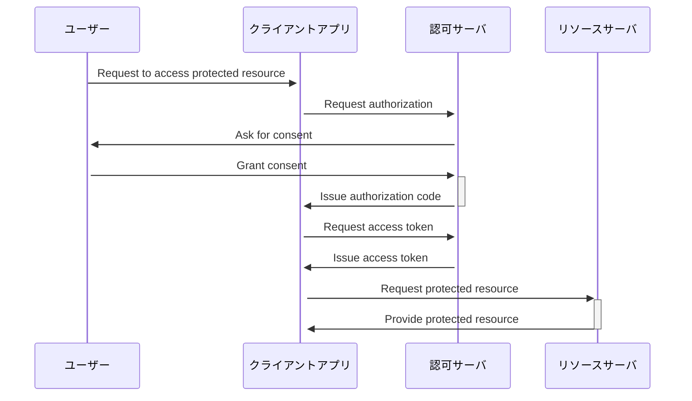

# シーケンス図

### 認可サーバー(トークン発行)
```JavaScript
const jwt = require('jsonwebtoken');

// JWTの秘密鍵
const secret = 'mysecret';

// ユーザー情報（ここではIDのみ）
const user = {
  id: 12345
};

// トークンを発行する関数
function generateToken() {
  // JWTに必要な情報を定義
  const payload = {
    sub: user.id,
    iat: Math.floor(Date.now() / 1000),
    exp: Math.floor(Date.now() / 1000) + (60 * 60) // 有効期限は1時間
  };

  // JWTを発行
  const token = jwt.sign(payload, secret);

  return token;
}

```

### リソースサーバー(トークンの検証)
```JavaScript
const jwt = require('jsonwebtoken');
const express = require('express');

// JWTの秘密鍵
const secret = 'mysecret';

// Expressアプリケーションを作成
const app = express();

// ルートエンドポイント
app.get('/', (req, res) => {
  // Authorizationヘッダーからトークンを取得
  const authHeader = req.headers['authorization'];
  const token = authHeader && authHeader.split(' ')[1];

  if (!token) {
    // トークンがない場合はエラーを返す
    res.status(401).json({ error: 'Unauthorized' });
  } else {
    // トークンを検証
    jwt.verify(token, secret, (err, decoded) => {
      if (err) {
        // トークンが無効な場合はエラーを返す
        res.status(401).json({ error: 'Unauthorized' });
      } else {
        // トークンが有効な場合は、ユーザーIDを返す
        res.json({ userId: decoded.sub });
      }
    });
  }
});

// サーバーを起動
app.listen(3000, () => {
  console.log('Server started on port 3000');
});
```