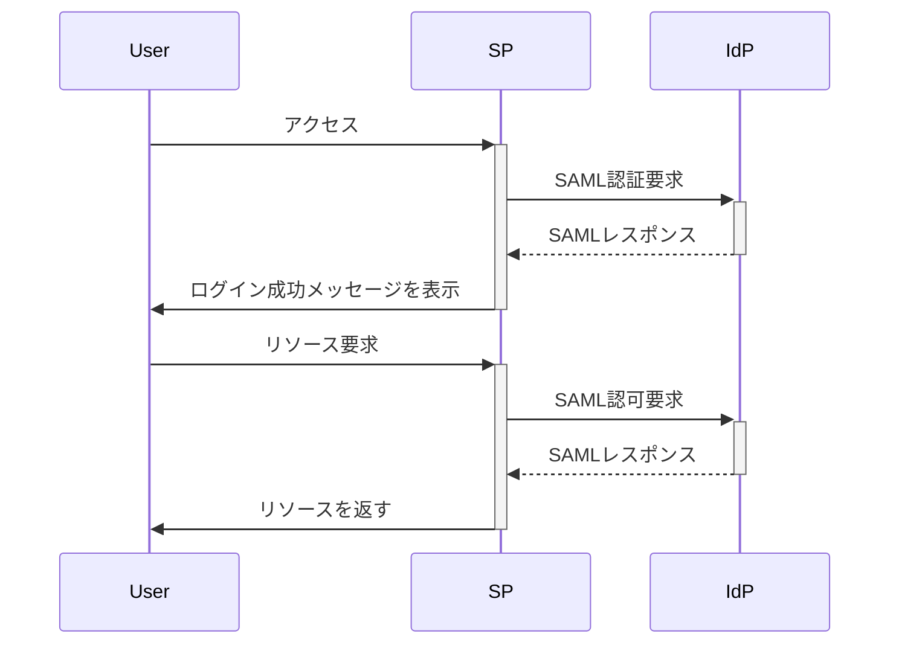
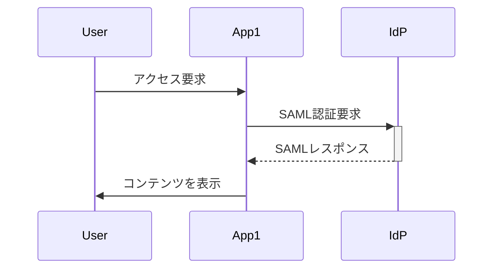

# シーケンス図
### 初回

```mermaid
sequenceDiagram
  participant User
  participant SP
  participant IdP

  User->>+SP: アクセス
  SP->>+IdP: SAML認証要求
  IdP-->>-SP: SAMLレスポンス
  SP->>-User: ログイン成功メッセージを表示
  User->>+SP: リソース要求
  SP->>+IdP: SAML認可要求
  IdP-->>-SP: SAMLレスポンス
  SP->>-User: リソースを返す


```

### ２回目以降

```mermaid
sequenceDiagram
  participant User
  participant App1
  participant IdP

  User->>App1: アクセス要求
  App1->>+IdP: SAML認証要求
  IdP-->>-App1: SAMLレスポンス
  App1->>User: コンテンツを表示
```